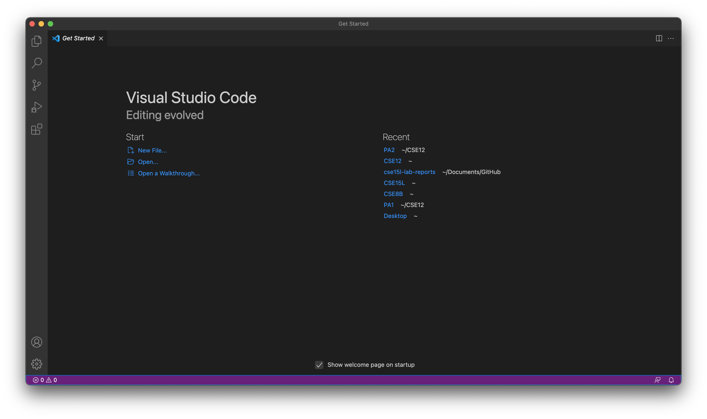
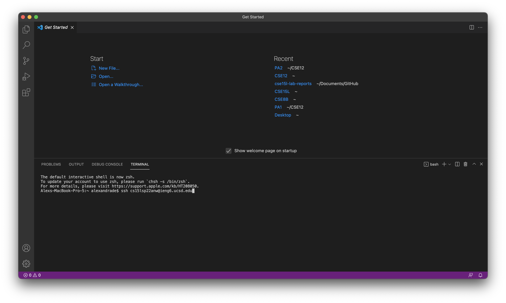
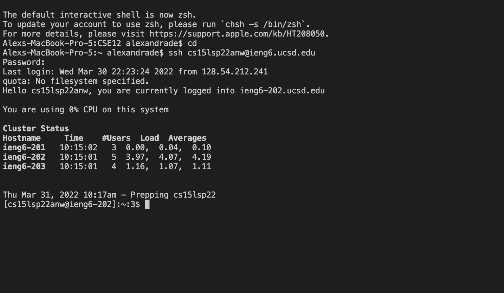
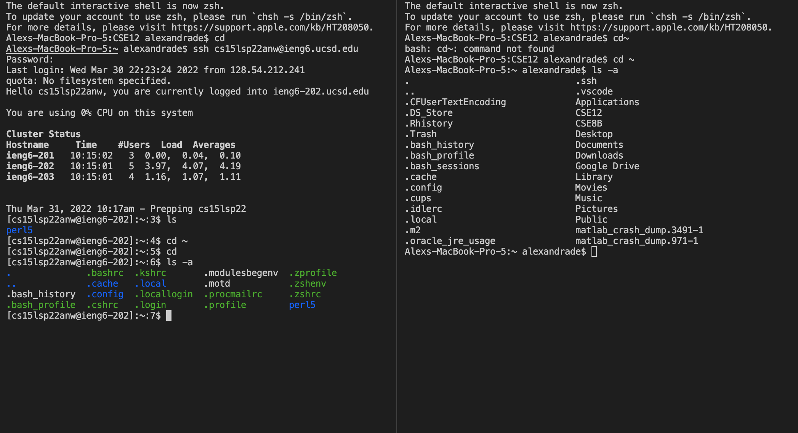
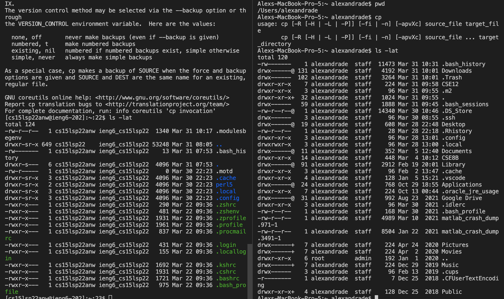
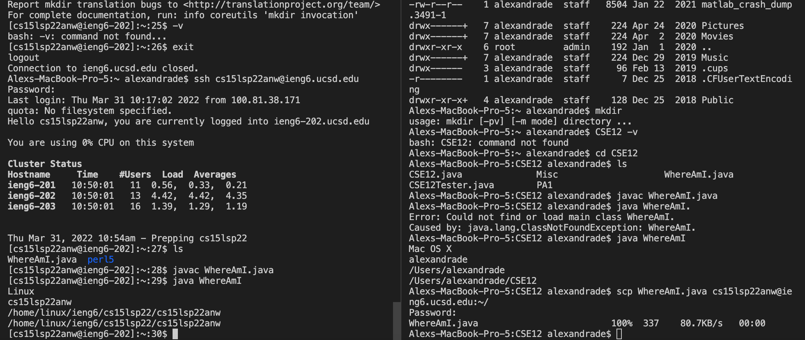
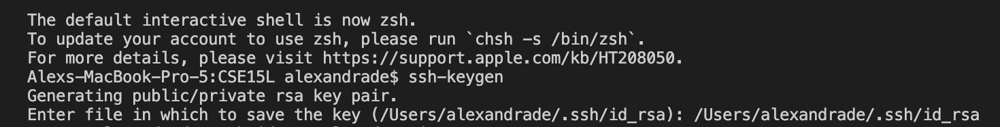
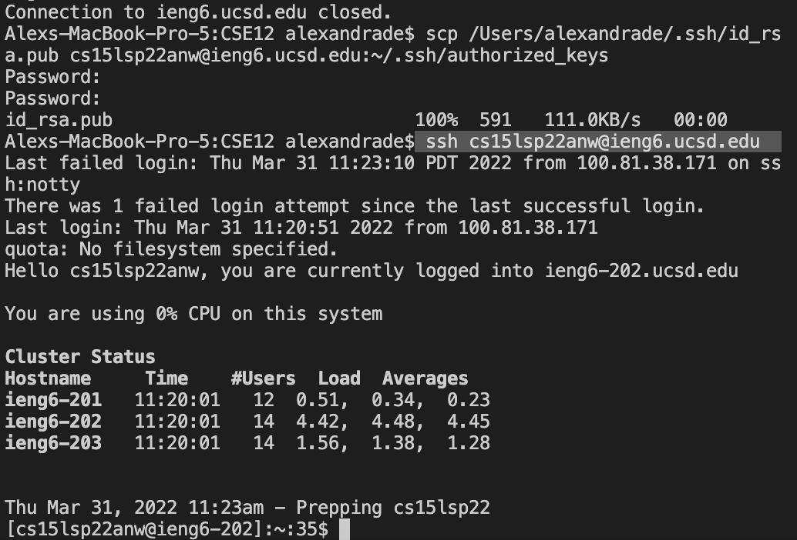
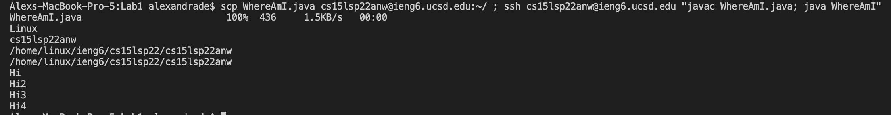

# Lab Report 1-Setting up Remote Access
Alex Andrade-A16488469  
CSE15L  
Spring 2022

---

## How to Install VS Code 
1. Navigate to the VS Code website at [this link](https://code.visualstudio.com/) and click the correct download button for your operating system
2. Once installed on your computer, open up the application and it should look like 
3. Once you reach this page you have finished installing VS Code

---

## How to Connect Remotely 
1. Find your CSE15L account at [this link](https://sdacs.ucsd.edu/~icc/index.php) and mark it down for future reference
2. Open a terminal in VS Code and enter the command     
`$ ssh cs15lsp22anw@ieng6.ucsd.edu`                           
but with the "anw" replaced by the letters in your account

3. A message will probably appear asking if you want to connect to this server as this will probably be your first time connecting to this server.
4. Say `yes` to this message but if it appears too often, your connection may not be private.
5. Enter your password and your screen should now look like 
6. Your computer (called the client) is now connected to a computer in the CSE building (called the server) and commands will be run on this computer

---

## Trying Commands
1. Try some commands like `cd`, `ls`, and `pwd` on both your computer and the remote computer
2. You can also try other commands like:
* `mkdir`
* `cp`
* `cd ~`
* `ls -a`
* `ls -t`
* `ls -lat`
3. You should get different outputs when running the same command on your computer versus the remote computer like  or like 

---

## Moving Files with `scp`
1. Create a file on your computer called `WhereAmI.java` and put the following code in it 
```
class WhereAmI {
  public static void main(String[] args) {
    System.out.println(System.getProperty("os.name"));
    System.out.println(System.getProperty("user.name"));
    System.out.println(System.getProperty("user.home"));
    System.out.println(System.getProperty("user.dir"));
  }
}
```
2. Run `WhereAmI.java` using `javac` and `java` on your computer and note down the output
3. In the terminal from the directory where the file is located on your computer run the command         
`scp WhereAmI.java cs15lsp22anw@ieng6.ucsd.edu:~/`      
with the "anw" replaced by the letters in your account
4. You should next enter your password to your account when asked
5. Log into the ieng6 server using the `ssh` command and use the `ls` command
6. `WhereAmI.java` should now be in the home directory and can be run on the ieng6 computer using `javac` and `java`
7. The output should be different on the ieng6 computer compared to your computer and should look something like 

---

## Setting a SSH Key
1. Run the following command on your computer       
`$ ssh-keygen`  
2. When asked where to save the file, use the format        
`(/Users/<user-name>/.ssh/id_rsa): /Users/<user-name>/.ssh/id_rsa`         
to save it like 
3. When prompted for a passphrase simply hit the enter key to set no password and your terminal should now look something like 
```
Your identification has been saved in /Users/<user-name>/.ssh/id_rsa.
Your public key has been saved in /Users/<user-name>/.ssh/id_rsa.pub.
The key fingerprint is:
SHA256:jZaZH6fI8E2I1D35hnvGeBePQ4ELOf2Ge+G0XknoXp0 <user-name>@<system>.local
The key's randomart image is:
+---[RSA 3072]----+
|                 |
|       . . + .   |
|      . . B o .  |
|     . . B * +.. |
|      o S = *.B. |
|       = = O.*.*+|
|        + * *.BE+|
|           +.+.o |
|             ..  |
+----[SHA256]-----+
```
4. To copy the public key to the `.ssh` directory of your account on the server log onto the server using `ssh` and run the command                               
`$ mkdir .ssh`
5. Logout from the server and run the command   
`$ scp /Users/<user-name>/.ssh/id_rsa.pub cs15lsp22zz@ieng6.ucsd.edu:~/.ssh/authorized_keys`
using your account and computer information
6. You should now be able to connect to the server from this client with no password like 

---

## Optimizing Remote Running
1. Try to make remote running more optimized with the following hints:
* Writing a command in quotes at the end of a `ssh` command directly runs it on the server then exits like  
`$ ssh cs15lsp22zz@ieng6.ucsd.edu "ls"`
* Use semicolons to run multiple commands on the same line like     
`$ cp WhereAmI.java OtherMain.java; javac OtherMain.java; java WhereAmI`
* Use the up-arrow on your keyboard to recall past commands
2. One example of a more optimized execution of remote running is 
as this copies and runs the command on the remote computer in one line

---

The source for this report and some of the code used was the lab writeup at [this link](https://docs.google.com/document/d/1AO6RDoJnaWxMui-UFjEa_2bbQ4qcANpbIpPuV-awsOg/edit)