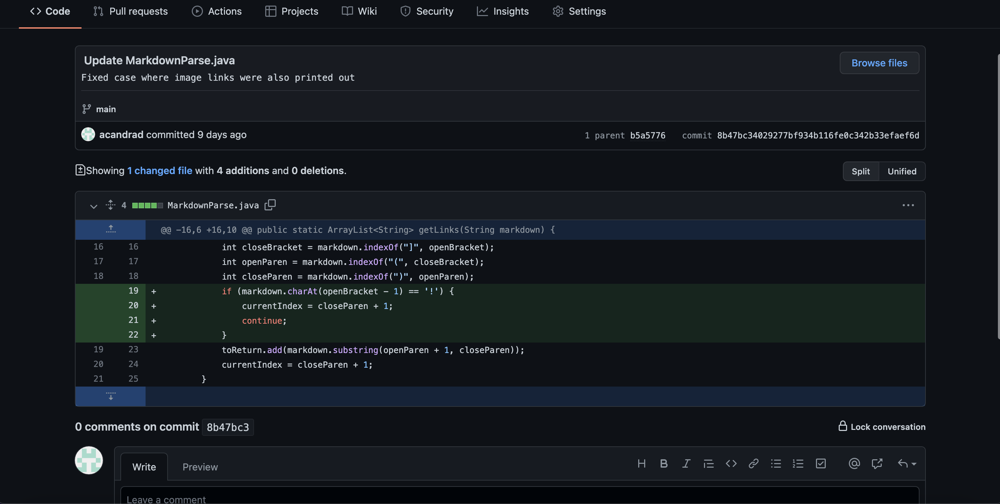

# Lab Report 2-Incremental Coding and Bug Fixing
Alex Andrade-A16488469  
CSE15L  
Spring 2022

---

## First Bug Fix

One of the changes I made to markdownparser.java in order to fix a bug was 

The test file that caused a *failure-inducing input* can be found at [this_link](Lab_3_Tests/test2.html) 