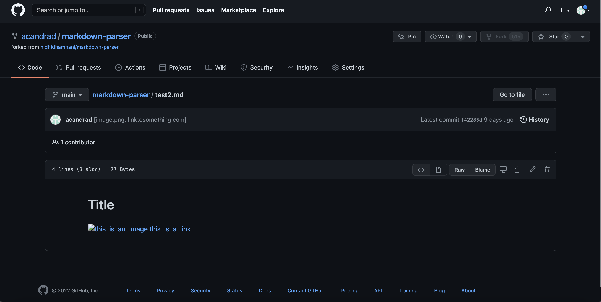
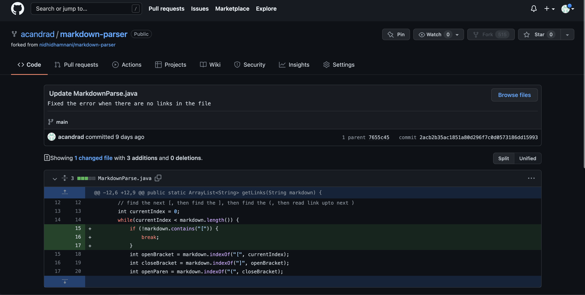
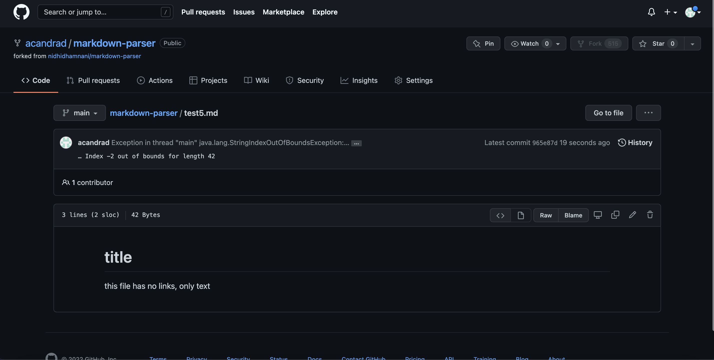
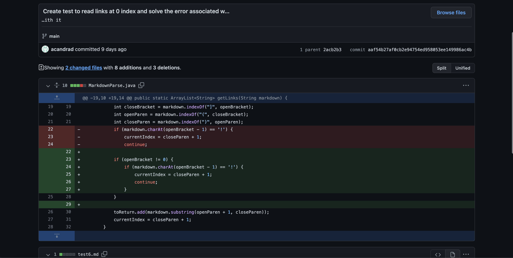
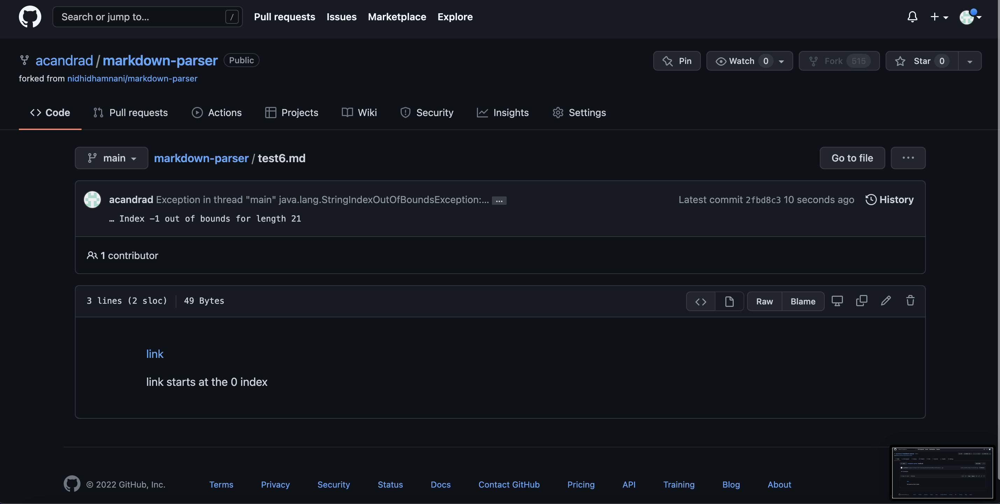

# Lab Report 2-Bug Fixing
Alex Andrade-A16488469  
CSE15L  
Spring 2022

---

## First Bug Fix

One of the changes I made to `MarkdownParse.java` in order to fix a bug was 

The test file that caused a *failure-inducing input* can be found at [this link](Lab_3_Tests/test2.md) 

The *symptom* of the *failure-inducing input* was that `[image.png, linktosomething.com]` was printed out on the command line as shown  

The relationship between the bug, the symptom, and the failure-inducing input was that the bug was the fact that the `getLinks` method didn't check for if the brackets were for an image or link. Thus the symptom of this bug was that if a markdown file contained an image, the image link would also be printed out instead of just website links. The failure-inducing input therefore demonstrated this symptom by including an image link so that the image link would be printed out by the `getLinks` method. 

---

## Second Bug Fix

Another change I made to `MarkdownParse.java` in order to fix a bug was 

The test file that caused a *failure-inducing input* can be found at [this link](Lab_3_Tests/test5.md)

The *symptom* of the *failure-inducing input* was that a `StringIndexOutOfBoundsException` error was printed out on the command line as shown 

The relationship between the bug, the symptom, and the failure-inducing input was that the bug was the fact that the `getLinks` method indexes the `[` character without checking if it is actually in the file or not. Thus the symptom of this bug was that if a file did not contain the `[` character, a `StringIndexOutOfBoundsException` error would occur as the method would try to index a character that didn't exist and the error would be printed on the command line. The failure-inducing input therefore demonstrated this symptom by not containing the `[` character so that the error message would be printed on the command line. 

---

## Third Bug Fix

A third change I made to `MarkdownParse.java` in order to fix a bug was 

The test file that caused a *failure-inducing input* can be found at [this link](Lab_3_Tests/test6.md)

The *symptom* of the *failure-inducing input* was that a `StringIndexOutOfBoundsException` error was printed out on the command line as shown 

The relationship between the bug, the symptom, and the failure-inducing input was that the bug was the fact that the `getLinks` method would try to check the index before a `[` character without checking if that was actually a valid index or not. Thus the symptom of this bug was that if a link was at the very start of a file a `StringIndexOutOfBoundsException` error would occur as the method would try to index `-1` and the error would be printed on the command line. The failure-inducing input therefore demonstrated this symptom by starting with a link so that the error message would be printed on the command line. 