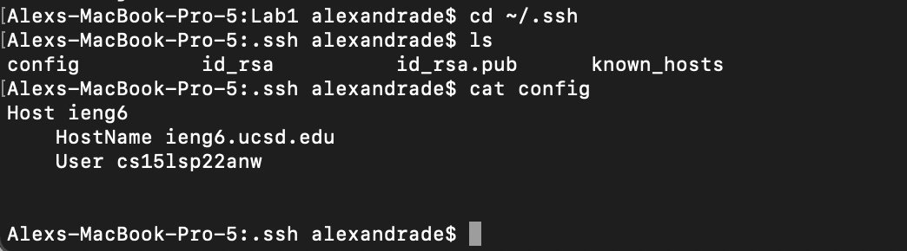
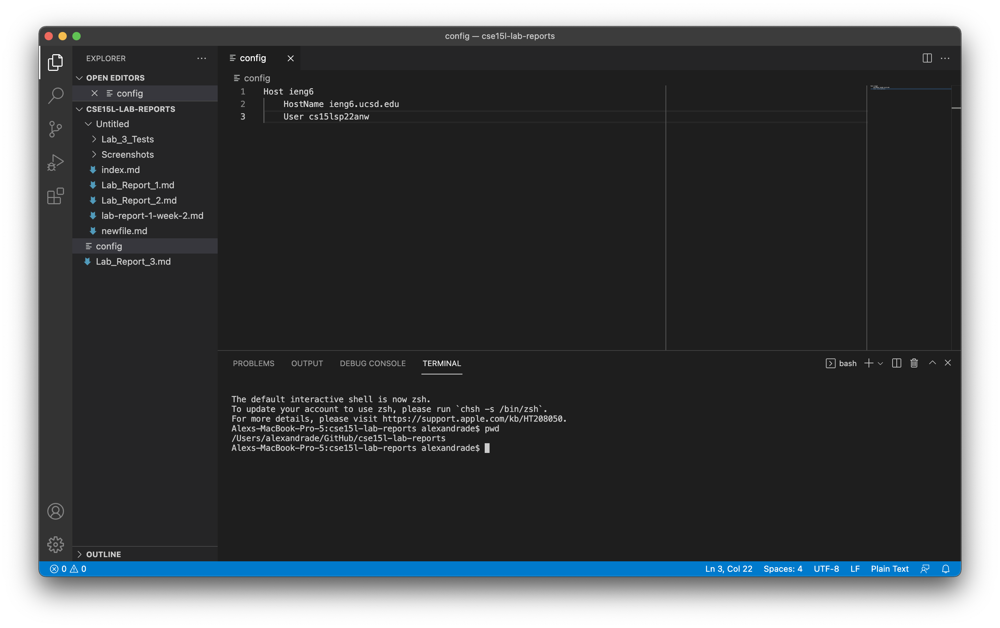
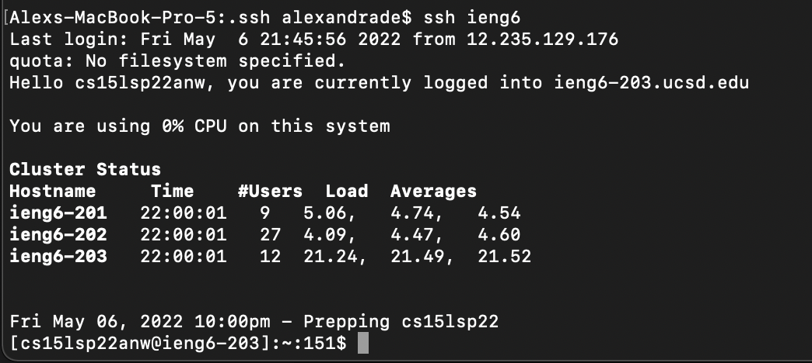
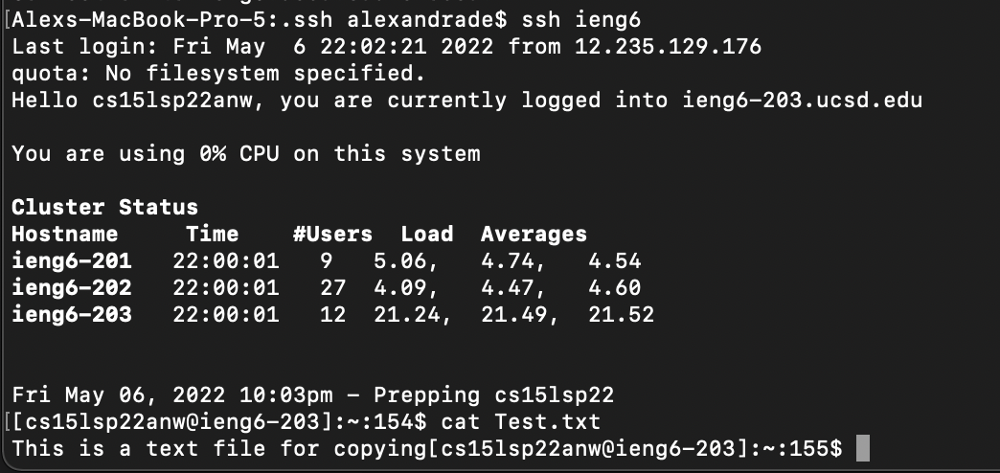
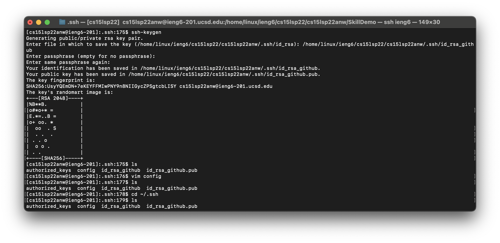
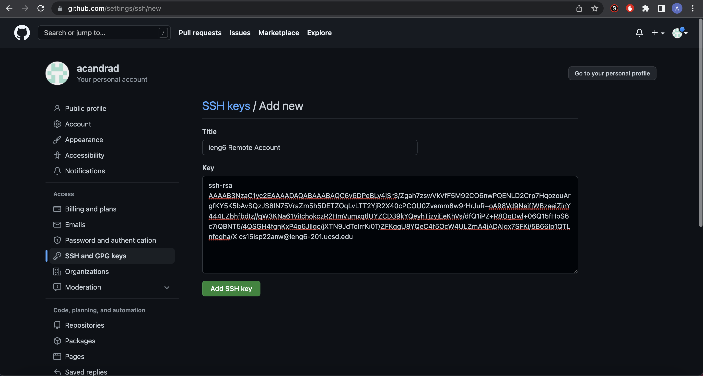
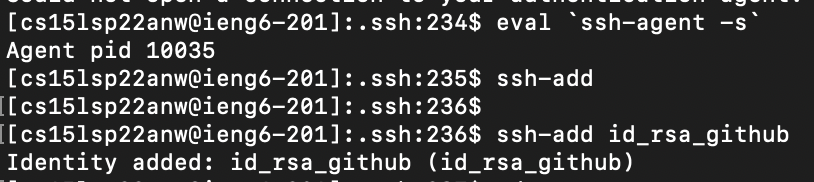
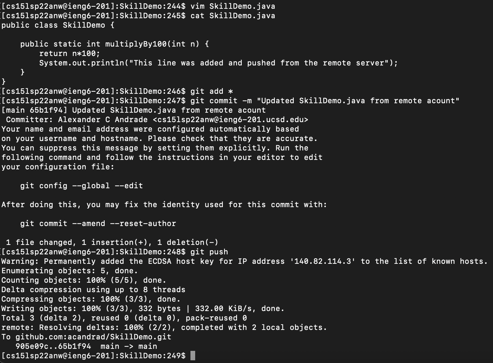

# Lab Report 3-Improving Remote Operations
Alex Andrade-A16488469  
CSE15L  
Spring 2022

---

## Streamlining ssh Configuration
1. In order to streamline ssh Configuration, you first need to make a `config` file in the `.ssh` directory like  which you can do through VScode like 
2. You can then move this `config` file into the `.ssh` directory from VScode and once you do that you should be able remotely log in from your computer using the alias you picked like 
3. Now that it is easier to log in to the remote server, it becomes easier to `scp` files as you don't need to type out the whole username and address and instead only need a simple command like  and you can see the results in the remote server 

---

## Setup Github Access from ieng6
1. You will need to create a public and private key pair on your remote account using `ssh-keygen` like  as you can see both the public and private key are now on the remote server.
2. Next, you need to add your public key to Github and you can follow [this link](https://docs.github.com/en/authentication/connecting-to-github-with-ssh/adding-a-new-ssh-key-to-your-github-account) to find out how to add SSH keys to your Github account and your public key should look like 
3. Then, you will have to run ```eval `ssh-agent -s` ``` and `ssh add` with the name of your private key like  in order to remotely access Github.
4. Now that both Github and the remote account have the public keys, you can commit and push changes to Github from your remote account like  and these changes will now show up on your Github account under commits like [here](https://github.com/acandrad/SkillDemo/commit/65b1f94f9ca679aa8bdbd54f4a6c399816ed0752)

---

## Copy whole directories with `scp -r`
1. 