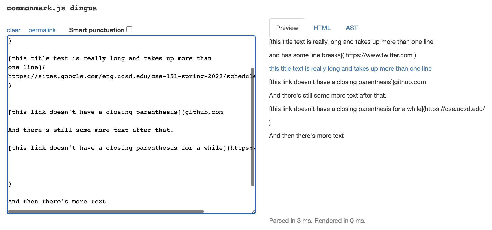

# Lab Report 4-Testing MarkdownParse
Alex Andrade-A16488469  
CSE15L  
Spring 2022

---

[Here is a link to my markdown-parse repository](https://github.com/acandrad/markdown-parser)
and [here is a link to the repository I reviewed in week 7](https://github.com/aejiang/markdown-parser)

---

## Markdown Snippet 1 Test

By using [the CommonMark demo site](https://spec.commonmark.org/dingus/), 
I decided that the first test file should produce this 
 which means that there should be links to ``` `google.com ```, `google.com`, and `ucsd.edu`. 

I was able to turn this Markdown Snippet into a Junit test using this 

For my implementation, the corresponding output when running the test was 
This test didn't pass and we can see in the picture above that the test failed because my implementation didn't output the correct links.

For the implementation I reviewed in Week 7, the corresponding output when running the test was 
This test didn't pass and we can see in the picture above that the test failed because the reviewed implementation didn't output the correct links.

---

## Markdown Snippet 2 Test

By using [the CommonMark demo site](https://spec.commonmark.org/dingus/), 
I decided that the second test file should produce this 
 which means that there should be links to `a.com`, `a.com(())`, and `example.com` . 

I was able to turn this Markdown Snippet into a Junit test using this 

For my implementation, the corresponding output when running the test was 
This test didn't pass and we can see in the picture above that the test failed because my implementation didn't output the correct links.

For the implementation I reviewed in Week 7, the corresponding output when running the test was 
This test didn't pass and we can see in the picture above that the test failed because the reviewed implementation didn't output the correct links.

---

## Markdown Snippet 3 Test

By using [the CommonMark demo site](https://spec.commonmark.org/dingus/), 
I decided that the third test file should produce this 
 which means that there should be a link to `https://sites.google.com/eng.ucsd.edu/cse-15l-spring-2022/schedule`. 

I was able to turn this Markdown Snippet into a Junit test using this 

For my implementation, the corresponding output when running the test was 
This test didn't pass and we can see in the picture above that the test failed because my implementation didn't output the correct link.

For the implementation I reviewed in Week 7, the corresponding output when running the test was 
This test didn't pass and we can see in the picture above that the test failed because the reviewed implementation didn't output the correct link.

---

## Fixing the Code

I think that there is a small code change that will make my program work for snippet 1 and all the related cases that use inline code with backticks and I think that change would be to check if the code contained within the backticks changes the markdown link. This is because for there to be a link in a `.md` file, the link has to have `[]` and `()` so if the backticks make it so one of these is not in the link, the markdown link wouldn't work and so we have to check for this case in order for my program to work on these cases.

I think that there is a small code change that will make my program work for snippet 2 and all the related cases that use nested parentheses, brackets, and escaped brackets and I think that change would be to check if each parenthesis, bracket, or escaped bracket has another closed form so that what is contained within is closed. This is because if the parentheses, brackets, or escaped brackets are closed, they won't affect the markdown links as shown with `[nested link](a.com)`, `a.com(())`, and `[some escaped \[ brackets \]](example.com)`.

I think that there is a small code change that will make my program work for snippet 3 and all the related cases that have newlines in brackets and parentheses and I think that change would be to check if there are newlines contained within the brackets and parentheses. This is because in snippet 3, the links that didn't work contained newlines that separated the ends of the brackets and parentheses while the link that did work, which was `[this title text is really long and takes up more than 
one line](
https://sites.google.com/eng.ucsd.edu/cse-15l-spring-2022/schedule
)`, didn't contain newlines between the brackets and parentheses so all the needed parts of the link were next to each other just on separate lines.