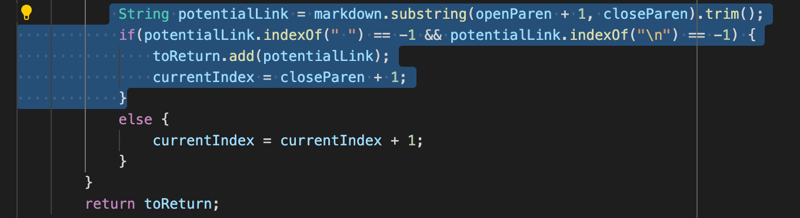
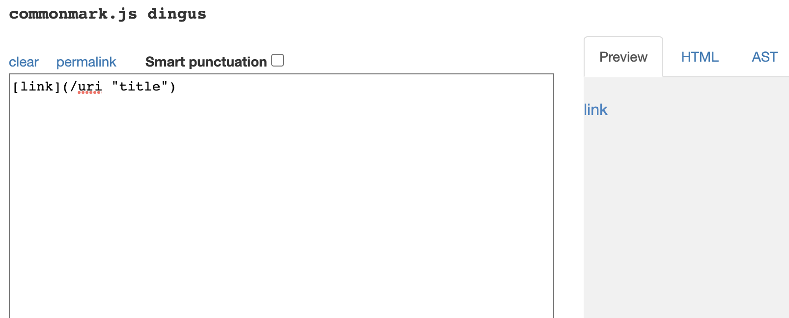
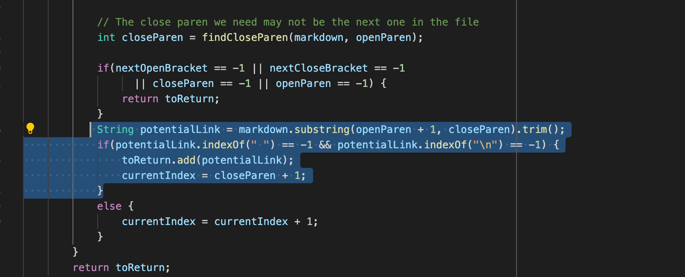

# Lab Report 5-Markdown Differences
Alex Andrade-A16488469  
CSE15L  
Spring 2022

---

The way I found the tests with different results was by running 
`bash script.sh > results.txt` in each repository in order to create a `.txt` file 
containing the results of running `getLinks` on each test file. Then I was able 
to use `vimdiff` to compare the two `.txt` files and find where differences in 
implementation occurred. 

## Markdown Test Difference 1-Test 201

[Here](https://github.com/nidhidhamnani/markdown-parser/blob/main/test-files/201.md?plain=1) is
a link to the test-file that produced different results between my implementation and the
provided implementation.

By using [the CommonMark demo site](https://spec.commonmark.org/dingus/), I decided that `201.md` should produce this  which means that there should not be any links produced when 
running `getLinks` and thus the output should be an empty ArrayList and so should be `[]`

Thus, by using CommonMark, we can see that the implementation on the left, which is my implementation, is correct
for this test and so the provided implementation is wrong for this test.

My implementation outputted an empty ArrayList correctly like `[]` while the provided implementation incorrectly outputted `[baz]` as shown 

The expected links in the output are no links and so the output should be an empty list like `[]` and so we can see that my implementation on the left is correct.

For the provided implementation, the bug that causes this incorrect output is  and I believe the bug is here because we are incorrectly adding a link when we shouldn't be. Thus, the bug is the fact that `baz` passes the checks for a link when it shouldn't so the bug is that the method doesn't check for `<` or `>` as I believe those symbols are what is keeping this from becoming a real link. Therefore the program is wrong as it doesn't check for `<` or `>` even though those will change the output and so incorrectly add a link when it shouldn't.

## Markdown Test Difference 2-Test 481

[Here](https://github.com/nidhidhamnani/markdown-parser/blob/main/test-files/481.md?plain=1) is
a link to the test-file that produced different results between my implementation and the
provided implementation.

By using [the CommonMark demo site](https://spec.commonmark.org/dingus/), I decided that `481.md` should produce this  which means that there should be a link to `/uri "title"` and so the output should be 
`[/uri "title"]`

Thus, by using CommonMark, we can see that the implementation on the left, which is my implementation, 
is correct for this test and so the provided implementation is wrong for this test.

My implementation outputted the correct list like `[/uri "title"]` 
while the provided implementation incorrectly outputted an empty ArrayList like `[]` as shown 

The expected link in the output is simply `/uri "title"` and so the output should be `[/uri "title"]` and so we can see that my implementation on the left is correct. 

For the provided implementation, the bug that causes this incorrect output is  and I believe the bug is here because we are not adding a link when we should be adding one. Thus, the bug is the fact that `/uri "title"` doesn't pass the check for a link when it should and I believe it doesn't pass this check as the link is only added if it has no space in it. However, based on the CommonMark output, we know that this link with a space is valid so the provided implementation is incorrectly discarding this link due to it having a space even though a link containing a space is a valid link. 